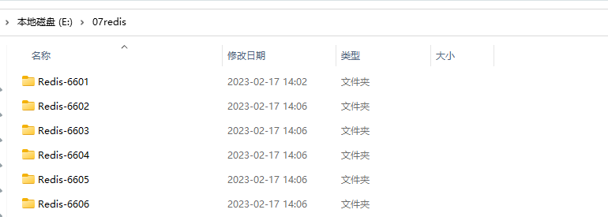
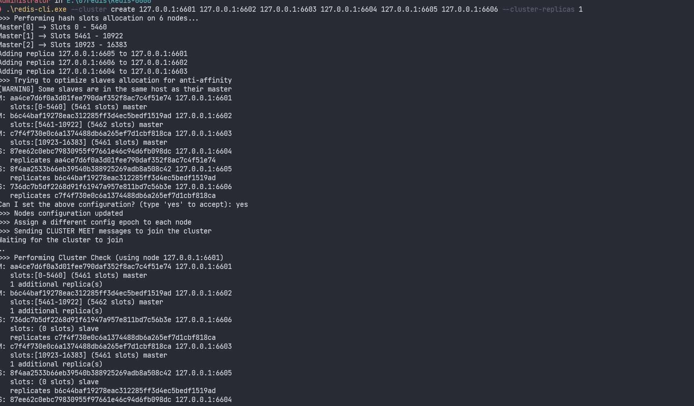
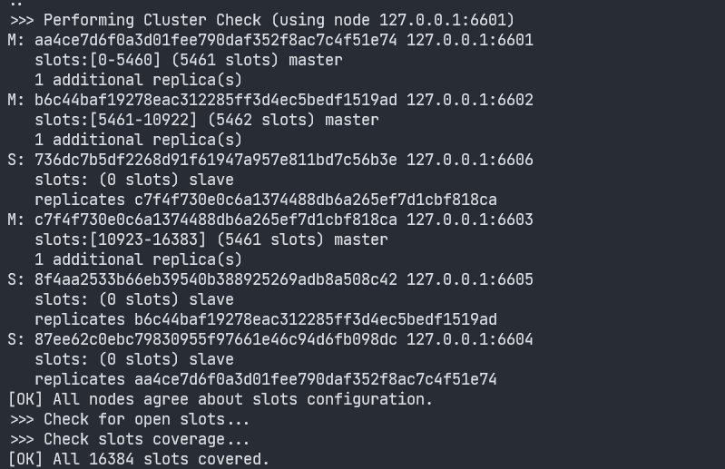
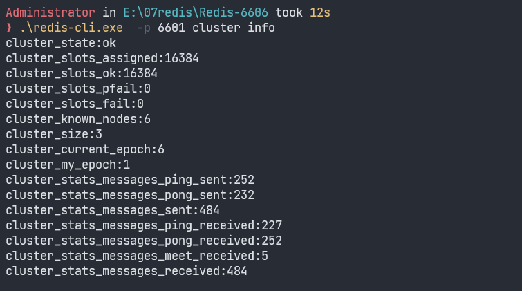
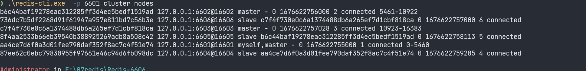

依次

# Redis 集群 windows下安装

## 1.下载Redis 5.0

    下载地址

    **https://github.com/tporadowski/redis/releases**

    没有科学上网的话 使用一下地址下载

    **https://ghproxy.com/https://github.com/tporadowski/redis/releases/download/v5.0.14.1/Redis-x64-5.0.14.1.zip**

    因为是本机模拟集群模式 所以下载的ZIP包

## 2.创建Redis 文件夹

## 3 创建节点文件夹

    由于是没有那么内存搭建6台虚拟机,使用本机模拟,所以这一步相当于在一个文件夹算一台物理机 启动一个redis服务，搭建三主三从 redis集群服务

    将刚刚下载好的zip 复制到Redis文件夹解压。然后复制6份，修改文件夹名称 我这里已端口为名称如下

    

## 4 依次就改6个文件夹中的配置

    依次打开每个redis文件夹的redis.windows.conf 文件

    依次修改配置

1. port 6601  //修改为与当前文件夹名字一样的端口号
2. appendonly yes //指定是否在每次更新操作后进行日志记录，Redis在 默认情况下是异步的把数据写入磁盘，如果不开启，可能会在断电时导4. 致一段时间内的数据丢失。 yes表示：存储方式，aof，将写操作记录保存到日志中
3. cluster-enabled yes //开启集群模式
4. cluster-config-file nodes-6380.conf //保存节点配置,自动创建,自动更新(建议命名时加上端口号)
5. cluster-node-timeout 15000 //集群超时时间，节点超过这个时间没反应就断定是宕机

   注意 如果需要设置密码  设置配置文件中的 requirepass  并且每个节点的密码需要一样

这里是为了模拟的时候方便建立的 服务器使用的话需要将redis 安装为服务

    依次创建启动bat 注意端口号

```
title redis-6601;
redis-server.exe redis.windows.conf
```

## 5 依次启动redis 服务

 由于是本机模拟 直接依次打开上一步创建的启动bat

## 6 创建Redis 集群

redis5.0之后新特性。

集群管理器被从Ruby（redis-trib.rb）移植到C代码内部redis-cli。
所以集群搭建在5.0之后不需要依赖ruby。

使用CMD 打开任意个redis 目录 cmd 执行 创建集群命令

cluster-replicas 1 表示一个主节点一个从节点 当前6个服务 就位3主 3从

ip地址需要和搭建环境更变

### 6.1 如果没设置密码使用下面命令启动

```
redis-cli.exe --cluster create 127.0.0.1:6601 127.0.0.1:6602 127.0.0.1:6603 127.0.0.1:6604 127.0.0.1:6605 127.0.0.1:6606 --cluster-replicas 1
```

### 6.2 如果设置密码了需要使用下面命令启动

```
redis-cli.exe -p 6601 -a 你的密码 --cluster create 127.0.0.1:6601 127.0.0.1:6602 127.0.0.1:6603 127.0.0.1:6604 127.0.0.1:6605 127.0.0.1:6606 --cluster-replicas 1
```

启动如下图：注意可能需要输入 yes

如果在启动过程中遇到启动不了或者报错 建议删除redis目录下的 .rdb和.aof的文件 或者删除新建的nodes下的文件



下面就是启动后的主从节点



## 7手动查看主从节点

CMD 到任意redis目录

没设置密码-a password 就不需要了

1.集群状态

```
redis-cli.exe -h ip -p 6601 -a password cluster info
```



2.集群节点信息

```
redis-cli.exe -h ip -p 6601 -a password cluster nodes
```


